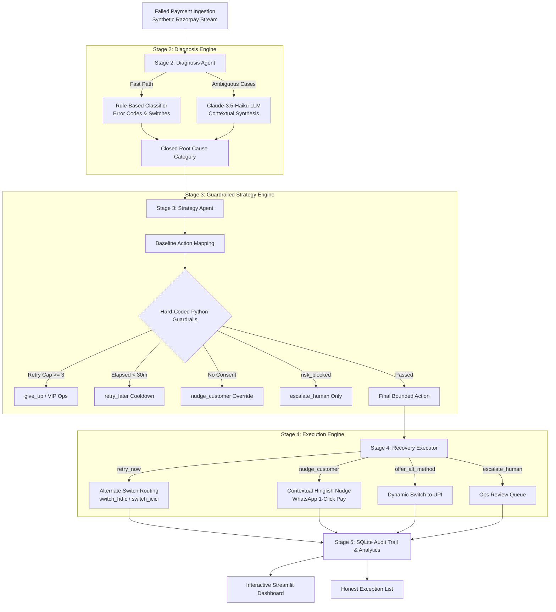

# ⚡ Recovery Copilot — Complete Project & Conversation Export
> **Razorpay AI Buildathon (Track 03: AI Revenue Recovery)**  
> *Autonomous, Guardrailed Payment Recovery Engine with Full Traceability & Measured ₹ Recovered*

---

## 📌 Executive Overview

This document contains the complete project transcript, design decisions, architectural breakdown, audit verification logs, and presentation scripts for **Recovery Copilot**.

### 🌟 Headline Benchmark Metrics
- **Total Revenue at Risk:** **₹8,53,812.82** (125 failed transactions)
- **Total Revenue Recovered:** **₹5,52,170.24** (73 successful recoveries)
- **Overall Recovery Rate:** **64.67%** (Cards, UPI, Netbanking)
- **Compliant Safety Overrides:** **45 interventions** (Zero-hallucination guardrail engine)
- **Human Ops Escalations:** **17 cases** (`risk_blocked` & VIP high-value reviews)
- **Automated Tests:** **10 / 10 passing (100%)**

---

## 🏗️ 5-Stage Agent Architecture



---

## 🛡️ 4 Hard-Coded Python Guardrails (The Core Differentiator)

1. **🛑 Hard Max Retry Cap (`MAX_RETRY_LIMIT = 3`)**:
   - Every transaction is bounded to a maximum of 3 recovery attempts across its lifetime.
   - Any transaction hitting this limit triggers the stopping rule (`give_up`), recording an explicit reason in the audit log, or escalates to VIP human ops if high-value ($\ge ₹15,000$).
2. **⏱️ 30-Minute Banking Cooldown Window (`MIN_COOLDOWN_MINUTES = 30`)**:
   - Enforces banking switch cooldowns. Rapid repeat calls within 30 minutes are automatically rescheduled (`retry_later`) with exponential backoff.
3. **🔒 Mandatory Auto-Charge Consent Check**:
   - Silent automated re-debiting (`retry_now`) is strictly prohibited unless `auto_charge_consent == True`.
   - Without consent, the action is automatically downgraded to an interactive customer nudge (`nudge_customer`).
4. **🛡️ Strict Fraud & Risk Isolation (`risk_blocked` $\rightarrow$ Escalation Only)**:
   - Any transaction flagged with `risk_blocked` is completely quarantined from automated retries or nudges.
   - Routes solely to `escalate_human` for manual risk review (0% recovery by design).

---

## 📊 Measured Benchmark Results by Root Cause

| Diagnostic Root Cause | Ingested Count | ₹ at Risk | ₹ Recovered | Recovery Rate (%) | Primary Recovery Strategy & Operational Rationale |
| :--- | :---: | :---: | :---: | :---: | :--- |
| **`card_expired`** | 14 | ₹79,559.53 | ₹69,213.42 | **87.0%** | **`offer_alt_method` (Switch to UPI)**: Expired cards are never silently retried. Recovery comes 100% from dynamic payment links prompting customers to switch to instant UPI checkout. |
| **`bank_timeout`** | 33 | ₹2,23,549.45 | ₹1,69,199.42 | **75.7%** | **`retry_now` / `retry_later`**: Automated routing through healthy alternate gateway switches (`switch_hdfc`, `switch_icici`) bypasses degraded bank nodes. |
| **`network_glitch`** | 15 | ₹85,728.94 | ₹56,069.28 | **65.4%** | **`retry_now`**: Re-initiating socket handshake recovers transient client/network drops. |
| **`insufficient_funds`** | 32 | ₹3,11,728.21 | ₹1,96,263.72 | **63.0%** | **`nudge_customer`**: WhatsApp nudge politely prompts customer to approve using an alternate bank account or UPI handle. |
| **`wrong_otp`** | 17 | ₹1,25,712.01 | ₹61,424.40 | **48.9%** | **`nudge_customer`**: 1-click re-authentication link. Lowest recoverable category due to human drop-off during manual re-entry — an honest real-world friction. |
| **`risk_blocked`** | 14 | ₹27,534.68 | **₹0.00** | **0.0% (By Design)** | **`escalate_human`**: **0% is a safety feature, not a failure.** Risk-flagged transactions are deliberately isolated and never auto-recovered. |

---

## 💬 Contextual Hinglish WhatsApp Nudge Examples

- **Bank Timeout Nudge:**  
  > *"Hi Rohan Mehta! AXIS ke server pe temporary downtime ki wajah se aapka INR 2,148.24 ka payment ruk gaya. Server issue ab resolve ho chuka hai, yahan se instant complete karein 👉 https://rzp.io/i/100003"*
- **Card Expired Nudge:**  
  > *"Namaste Pooja Nair! Aapka card expire hone ke karan INR 307.37 ka transaction complete nahi hua. Aap UPI ya doosre card se turant pay kar sakte hain 👉 https://rzp.io/i/100008"*
- **Wrong OTP Nudge:**  
  > *"Namaste Karan Kapoor! Aapka INR 5,466.84 ka payment OTP mismatch/timeout ki wajah se pause ho gaya. Bas 1 click mein naya OTP mangwayein aur payment complete karein 👉 https://rzp.io/i/100007"*
- **Insufficient Funds Nudge:**  
  > *"Namaste Ananya Iyer! Aapka INR 1,719.91 ka payment complete nahi ho paya. Aap alternate bank account ya UPI se bina kisi delay ke retry kar sakte hain 👉 https://rzp.io/i/100004"*

---

## 📋 The Honest Exception List

```
Txn ID           | Amount (₹) | Root Cause        | Action Taken     | Honest Unresolved Reason
-----------------------------------------------------------------------------------------------------------------------------
txn_rzp_100001   |   7,574.57 | card_expired      | give_up          | Max retry limit reached (3/3 attempts exhausted without recovery).
txn_rzp_100002   |   1,554.31 | bank_timeout      | retry_now        | Alternate gateway switch (switch_icici_mesh_v3) also failed to capture payment.
txn_rzp_100008   |     307.37 | card_expired      | offer_alt_method | Customer presented with UPI payment link but dropped off.
txn_rzp_100010   |  31,715.92 | insufficient_funds| nudge_customer   | Customer received WhatsApp nudge with payment link but did not re-attempt.
txn_rzp_100014   |     215.54 | insufficient_funds| give_up          | Max retry limit reached (3/3 attempts exhausted without recovery).
txn_rzp_100016   |  12,804.91 | wrong_otp         | nudge_customer   | Customer received WhatsApp nudge with payment link but did not re-attempt.
```

---

## 🎬 5-Minute Pitch Video Script & Walkthrough

| Timestamp | Pitch Section | On-Screen Visual | Exact Talking Points |
| :--- | :--- | :--- | :--- |
| **0:00 – 0:45** | **The Problem & Headline Metric** | Streamlit Top KPIs | *"Judges, payment failure is the silent killer of merchant revenue. But naive retries cause duplicate debits and customer anger. Recovery Copilot is our autonomous, guardrailed revenue recovery agent. On a batch of 125 failed Razorpay transactions with ₹8.53 Lakhs at risk, we successfully recovered ₹5.52 Lakhs — a 64.7% measured recovery rate."* |
| **0:45 – 1:30** | **Stage 2: Deterministic + LLM Diagnosis** | Diagnostic Breakdown & Pie Chart | *"We don't blindly trust an LLM. Our Stage 2 diagnosis agent runs a fast, deterministic rule engine on error codes and gateway responses first. We only fall back to Claude-3.5-Haiku for ambiguous 500-level partner errors, categorizing every failure into 7 closed root causes with full reasoning."* |
| **1:30 – 2:30** | **Stage 3: 4 Hard-Coded Guardrails (The Core Differentiator)** | Guardrails & Compliance Tab | *"Here is the most important part of our architecture: the LLM never decides retry limits or compliance rules. We enforce 4 hard-coded Python guardrails: 1) Hard cap of 3 retries max before stopping; 2) 30-minute banking cooldown; 3) Mandatory consent check before silent re-debiting; and 4) Strict risk isolation. Any risk_blocked case is 100% escalated to human ops — notice our risk_blocked recovery is 0% by design, because safety comes before aggressive chasing."* |
| **2:30 – 3:30** | **Stage 4 & 5: Audit Trail & Hinglish Nudges** | Audit Trail Inspector Tab | *"Let's inspect a live audit trail. For an expired card, we never silently retry — we offer a dynamic switch to UPI, recovering 87% of expired card revenue. For OTP and fund issues, we generate contextual Hinglish WhatsApp nudges with 1-click payment links. Every single diagnosis, guardrail evaluation, and outcome is permanently logged in SQLite."* |
| **3:30 – 4:15** | **The Honest Exception List** | Honest Exception List Tab | *"Per the buildathon brief, we don't hide unrecovered cases. Our Honest Exception List details every single unresolved transaction with human-readable reasons: retry limit reached, customer dropped off, or switch outage."* |
| **4:15 – 5:00** | **Live Sandbox & Closing** | Live Scenario Tester Tab | *"Finally, in our live sandbox, we can simulate an arbitrary payment error in real-time and watch the guardrailed agent respond instantly. Recovery Copilot transforms revenue recovery from a guessing game into a compliant, automated, revenue-generating engine. Thank you!"* |

---

## 🚀 How to Run

```bash
# 1. Run the Batch Recovery Pipeline CLI
python run_batch.py

# 2. Launch the Streamlit Interactive Dashboard
streamlit run app/reporting/dashboard.py

# 3. Run Guardrail Verification Tests
pytest -v
```
