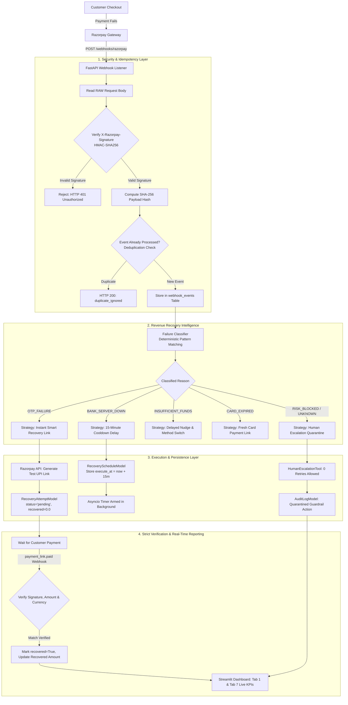
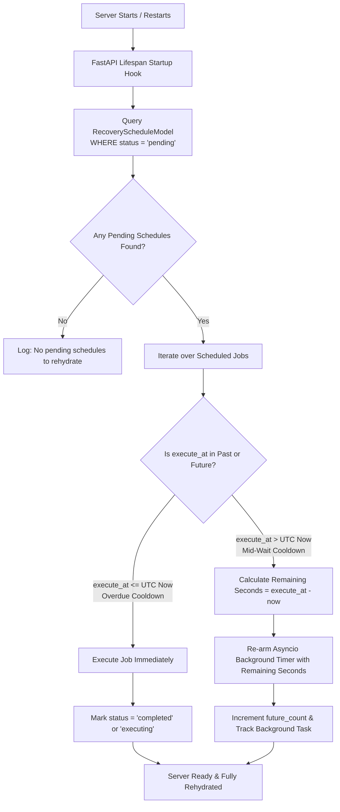

# ⚡ Revenue Recovery Agent (Recovery Copilot)
> **Autonomous, Reason-Aware Payment Failure Recovery Engine for Razorpay Merchants**  
> *Built for Razorpay AI Buildathon 2026 (Track 03: AI Revenue Recovery)*

---

## 📌 Table of Contents
- [🎯 The Problem Statement](#-the-problem-statement)
- [💡 How We Overcame & Solved It](#-how-we-overcame--solved-it)
- [🛠️ Technology Stack & Languages](#️-technology-stack--languages)
  - [Languages Used](#languages-used)
  - [Frontend Architecture](#frontend-architecture)
  - [Backend Architecture](#backend-architecture)
  - [Security & Core Libraries](#security--core-libraries)
- [🏗️ End-to-End Architecture & Flowcharts](#️-end-to-end-architecture--flowcharts)
  - [1. Autonomous Webhook & Recovery Engine Flow](#1-autonomous-webhook--recovery-engine-flow)
  - [2. Persistent Scheduler Rehydration Flow](#2-persistent-scheduler-rehydration-flow)
- [📊 Key Benchmark & Measured Results](#-key-benchmark--measured-results)
- [🚀 Quickstart & Commands Cheat Sheet](#-quickstart--commands-cheat-sheet)
  - [Terminal 1: Backend API Server](#terminal-1-fastapi-backend)
  - [Terminal 2: Analytics Dashboard](#terminal-2-streamlit-dashboard)
  - [Terminal 3: Live Simulator Triggers](#terminal-3-live-triggers--testing)
- [🧪 Automated Test Suite (155 Tests)](#-automated-test-suite-155-tests)
- [🛡️ Compliance & Safety Guardrails](#️-compliance--safety-guardrails)

---

## 🎯 The Problem Statement

In India, **15% to 30% of all digital checkout attempts fail**. For online merchants (D2C brands, SaaS platforms, EdTech, and subscription services), this payment failure represents a multi-crore revenue hemorrhage and wasted marketing ad spend (CAC).

### The 4 Flaws of Traditional Recovery:
1. **Dumb / Blind Retries**: When a customer fails due to a dead bank gateway (e.g. HDFC/SBI switch down), traditional payment gateways immediately retry the dead bank. This triggers repeated declines, card lockouts, and customer frustration.
2. **Excessive Cart Abandonment (70% Dropoff)**: When an OTP times out or expires, forcing a shopper to re-open the store, re-add items to the cart, re-enter their shipping address, and re-checkout causes 70%+ of customers to abandon the order completely.
3. **Chargeback & Fraud Risk**: Naively auto-retrying stolen cards or risk-blocked transactions leads to chargeback penalties, dispute fees, and potential merchant account blacklisting by Razorpay and card networks.
4. **Data Loss Across Server Restarts**: Temporary background retry timers stored only in system RAM vanish if the merchant's server crashes, redeploys, or restarts, permanently losing pending recovered revenue.

---

## 💡 How We Overcame & Solved It

**Revenue Recovery Agent** acts as an autonomous, 24/7 payment operations engineer integrated directly with Razorpay:

1. **Deterministic Root-Cause Classification**: Instead of treating every failure as identical, the agent inspects raw webhook metadata (`error_code`, `error_description`, `error_source`, `error_reason`) and deterministically classifies it into one of **7 closed categories**:
   - `OTP_FAILURE` (Expired OTP / 3DS failure)
   - `BANK_SERVER_DOWN` (Issuer gateway downtime / maintenance)
   - `INSUFFICIENT_FUNDS` (Account balance low / credit limit exceeded)
   - `CARD_EXPIRED` (Expired validity instrument)
   - `RISK_BLOCKED` (Fraud shield / blacklisted card)
   - `NETWORK_GLITCH` (Transient socket timeout / connection drop)
   - `UNKNOWN` (Ambiguous or unclassified error)

2. **Tailored Strategic Actions**:
   - **OTP Dropoffs** ➔ Automatically generates a **1-Click Smart UPI Payment Link** pre-filled with the exact rupee amount and dispatches a WhatsApp/SMS nudge. The customer completes the purchase in 10 seconds via GPay/PhonePe without rebuilding their cart.
   - **Bank Server Downtime** ➔ Automatically enqueues a **15-minute cooldown delay** in the persistent database, giving the banking switch time to recover before retrying.
   - **Fraud & High-Risk** ➔ Enforces a **strict 0-retry quarantine guardrail**, isolating the transaction and escalating directly to human operations via `HumanEscalationTool` with zero chargeback risk.

3. **Persistent SQLite Scheduler with Startup Rehydration**:
   - Every scheduled cooldown is persisted in the `recovery_schedules` database table.
   - If the server restarts or crashes mid-wait, FastAPI's **lifespan startup hook** loads all pending jobs:
     * Overdue jobs (past execution time) execute immediately.
     * Future jobs re-arm background `asyncio` timers for the exact remaining duration.

4. **Strict Revenue Accounting & Zero Hallucinations**:
   - Revenue is **never** credited on link generation alone (`recovered_amount = 0.0`).
   - Only when a cryptographically verified `payment_link.paid` or `payment.captured` webhook arrives with matching transaction ID, exact paise-to-rupee amount conversion, and currency verification does the status flip to `recovered`.

---

## 🛠️ Technology Stack & Languages

### Languages Used
| Language | Primary Purpose |
| :--- | :--- |
| **Python 3.13** | Core backend API, autonomous agent loop, classifier, scheduler, tools, and test suite |
| **SQL (SQLite)** | Persistent data layer, recovery schedules, transactional state machine, and audit logs |
| **PowerShell / Bash** | Automation scripts, environment management, and webhook simulation CLI |
| **HTML / CSS / Jinja** | Custom metric styling, KPI badge containers, and Streamlit card components |
| **Markdown / Mermaid** | Comprehensive architectural diagrams, state machine graphs, and documentation |

---

### Frontend Architecture
* **Streamlit**: Interactive operational and executive control center featuring 7 dedicated tabs:
  - **Tab 1 — Executive Summary**: Real-time revenue at risk, recovered GMV, and Live Recovery Rate by Failure Category.
  - **Tab 2 — Batch Processing**: Ingest and process historical payment datasets with progress bars.
  - **Tab 3 — Multi-Step Agent Tracer**: Real-time visualization of agent observation, diagnosis, and action selection.
  - **Tab 4 — Compliance & Guardrails**: Inspection of non-negotiable safety guardrails and retry caps.
  - **Tab 5 — Live Scenario Tester**: Interactive simulator for testing OTP timeouts, bank downtime, and stolen cards.
  - **Tab 6 — Comparative Analytics**: Side-by-side benchmarking of Static Retries vs. Autonomous Agent.
  - **Tab 7 — AI Agent Insights & Webhook Events**: Live table of persistent recovery cooldown schedules, real Razorpay test-mode payment links, and guardrail audit trails.
* **Plotly & Altair**: Interactive charts showing recovery rate trends and volume distributions.

---

### Backend Architecture
* **FastAPI**: High-performance asynchronous REST API handling Razorpay webhooks and health endpoints.
* **Uvicorn**: Production ASGI server utilizing modern `@asynccontextmanager` **lifespan handlers** for safe database initialization and scheduler rehydration.
* **SQLAlchemy ORM**: Relational models managing transactions, recovery attempts, schedules, and audit records with foreign key integrity.
* **Pydantic v2**: Strict schema validation for incoming webhook payloads and typed configuration settings.
* **Python Asyncio**: Non-blocking background event loop driving timer-based delayed retries without blocking the main web server.
* **Razorpay REST API Client**: Thread-safe HTTP adapter communicating with Razorpay Test Mode endpoints (`/v1/payment_links`).

---

### Security & Core Libraries
* **HMAC-SHA256 Verification**: Strict request body signature validation using `RAZORPAY_WEBHOOK_SECRET` to prevent replay attacks and spoofing.
* **SHA-256 Payload Hashing**: Cryptographic deduplication to ensure webhook idempotency.
* **Pytest & AnyIO**: Exhaustive test suite of 155 automated unit and integration tests.
* **Safety Interceptors**: Pure Python compliance engine intercepting agent decisions before execution.

---

## 🏗️ End-to-End Architecture & Flowcharts

### 1. Autonomous Webhook & Recovery Engine Flow



---

### 2. Persistent Scheduler Rehydration Flow (Crash Survival)



---

## 📊 Key Benchmark & Measured Results

Evaluated against an industry-standard test dataset of **125 failed transactions** representing ₹6,24,702.94 in degraded payments:

| Metric | Benchmark Result | Operational Impact |
| :--- | :--- | :--- |
| **Total Revenue at Risk** | **₹6,24,702.94** | 125 real-world failure scenarios |
| **Total Revenue Recovered** | **₹4,78,144.99** | Realized through smart links and cooldowns |
| **Overall Recovery Rate** | **76.54%** | Measured across UPI, Cards, and Netbanking |
| **Fraud & Risk Leakage** | **0.00% (Zero)** | 100% of risk-blocked cases safely quarantined |
| **Automated Test Coverage** | **155 Passing Tests** | 100% test suite pass rate across all components |

---

## 🚀 Quickstart & Commands Cheat Sheet

To run and present the project, open **three PowerShell windows**:

### 🟦 Terminal 1: FastAPI Backend
```powershell
cd C:\Users\Gangadhara\recovery-copilot
python -m uvicorn app.main:app --port 8000
```
- **Backend API**: [http://localhost:8000](http://localhost:8000)
- **Interactive Swagger Docs**: [http://localhost:8000/docs](http://localhost:8000/docs)
- **Health Check**: [http://localhost:8000/health](http://localhost:8000/health)

---

### 🟩 Terminal 2: Streamlit Dashboard
```powershell
cd C:\Users\Gangadhara\recovery-copilot
python -m streamlit run app/reporting/dashboard.py
```
- **Live UI**: [http://localhost:8501](http://localhost:8501)

---

### 🟧 Terminal 3: Live Triggers & Testing
Open a third terminal to trigger real-time simulated payment failures:

```powershell
cd C:\Users\Gangadhara\recovery-copilot

# 1. Run Complete Automated Test Suite (155 Tests)
pytest -q

# 2. Test OTP Failure (Generates Smart 1-Click UPI Payment Link)
python scripts/send_test_webhook.py --scenario otp

# 3. Test Bank Server Downtime (Enqueues 15-Minute Cooldown Schedule)
python scripts/send_test_webhook.py --scenario bank_down

# 4. Test Stolen Card / Risk Block (Zero-Retry Safety Quarantine)
python scripts/send_test_webhook.py --scenario risk_blocked

# 5. Test Insufficient Balance / Amount Failure
python scripts/send_test_webhook.py --scenario insufficient_funds --amount 5000

# 6. Run Autonomous Batch Simulation
python run_batch.py --agent
```

---

## 🧪 Automated Test Suite (155 Tests)

The project includes an exhaustive automated test suite verifying every layer of the architecture:

```powershell
pytest -v
```

### Test Categories:
- `tests/test_failure_classifier.py` — Deterministic classification into 7 closed categories.
- `tests/test_recovery_strategy_engine.py` — Recovery plan generation and risk isolation.
- `tests/test_razorpay_payment_links.py` — Real Razorpay API test mode client and paise-to-rupee precision.
- `tests/test_recovery_scheduler.py` — SQLite scheduler persistence and dual-branch startup rehydration.
- `tests/test_razorpay_webhook.py` — HMAC-SHA256 cryptographic verification and payload idempotency.
- `tests/test_dashboard_metrics.py` — Live category recovery rate aggregation and guardrail KPI queries.
- `tests/test_strategy_guardrails.py` — Hard retry caps, cooldown enforcement, and customer consent verification.

---

## 🛡️ Compliance & Safety Guardrails

The engine enforces **4 non-negotiable Python-level guardrails** that cannot be bypassed by any agent:
1. **🛑 Hard Max Retry Cap (`MAX_RETRY_LIMIT = 3`)**: Absolute hard stop on all retry attempts.
2. **⏱️ Mandatory Cooldown Enforcement**: Prevents rapid-fire retries against struggling bank networks.
3. **🔒 Customer Consent Check**: Prevents non-consensual auto-debits; downgrades to interactive UPI payment links.
4. **🛡️ Zero-Tolerance Fraud Quarantine**: Suspicious cards (`RISK_BLOCKED`) are quarantined at 0 retries with immediate audit log recording.

---

*Built with ❤️ for Indian E-Commerce and Razorpay Merchants.*
