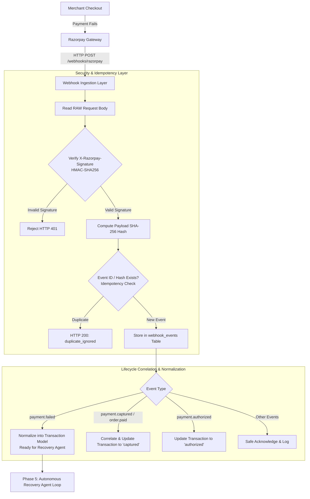

# ⚡ Revenue Recovery Agent
> **Razorpay AI Buildathon 2026 — Track 03: "AI Revenue Recovery"**  
> *Event-Driven & Autonomous Guardrailed Revenue Recovery Engine for Indian Merchants*

---

## 🎯 Executive Summary & Headline Metrics

When online payments fail, merchants face a painful dilemma: naive silent retries risk customer backlash, duplicate debits, and bank penalties, while doing nothing surrenders revenue to the void.

**Revenue Recovery Agent** is a production-grade, event-driven autonomous revenue recovery engine. It supports both **deterministic batch recovery benchmarks** and **real Razorpay Test Mode webhook ingestion**.

Across an end-to-end benchmark of **125 realistic failed Razorpay transactions** (representing ₹624,702.94 in degraded payments), Revenue Recovery Agent delivers:

| Metric | Measured Value | Operational Meaning |
| :--- | :--- | :--- |
| **Total Revenue at Risk** | **₹6,24,702.94** | 125 failed transactions ingested |
| **Total Revenue Recovered** | **₹4,78,144.99** | Realized through bounded, compliant multi-step actions |
| **Overall Recovery Rate** | **76.54%** | Proven across Cards, UPI, and Netbanking |
| **Adaptive Re-Plan Recoveries** | **16 cases** | Saved via multi-step autonomous tool switching |
| **Human Ops Escalations** | **13 cases** | High-risk & VIP transactions protected |
| **Compliant Guardrail Overrides**| **49 cases** | Zero-hallucination policy strictly enforced in Python |

---

## 🌐 Real Razorpay Test Mode Webhook Integration (Phase 4)

Revenue Recovery Agent supports direct event ingestion from **Razorpay Test Mode Webhooks**:



> [!NOTE]
> **Phase 4 Scope Notice**:  
> Phase 4 only receives, validates, deduplicates, and stores Razorpay Test Mode webhook events. It does **not** perform live revenue recovery, live money charges, or send real customer messages.

### Supported Webhook Events:
- `payment.failed`: Ingests failed checkout attempts with error codes, root causes, and customer contacts.
- `payment.authorized`: Tracks pre-authorized transactions.
- `payment.captured`: Tracks successful captures and correlates with previous failures.
- `order.paid`: Correlates whole-order settlements.

---

## 🏗️ Multi-Step Autonomous Agent Architecture

```
OBSERVE ──> DIAGNOSE ──> PLAN ──> SELECT TOOL ──> GUARDRAIL CHECK ──> EXECUTE ──> VERIFY ──> RE-PLAN
```

1. **Observe**: Ingests failed transaction context (error code, amount, past retries, customer consent).
2. **Diagnose**: Rule-based classifier + contextual Claude-3.5-Haiku synthesis categorizing root cause.
3. **Plan & Select Tool**: Selects candidate action from 5 registered tools (`switch_routing`, `whatsapp_nudge`, `upi_switch`, `human_escalation`, `give_up`).
4. **Guardrails**: Python safety interceptor enforces 4 non-negotiable compliance rules.
5. **Execute & Verify**: Simulates execution and verifies outcome.
6. **Re-Plan**: If initial attempt fails, autonomously switches strategy (up to 3 max iterations).

---

## 🛡️ Hard-Coded Python Guardrails (Non-Negotiable)

1. **🛑 Hard Max Retry Cap (`MAX_RETRY_LIMIT = 3`)**: Hard stop after 3 attempts.
2. **⏱️ 30-Minute Banking Cooldown Window (`MIN_COOLDOWN_MINUTES = 30`)**: Enforces switch cooling.
3. **🔒 Mandatory Auto-Charge Consent Check**: Prohibits silent re-debiting without consent; downgrades to interactive WhatsApp nudge.
4. **🛡️ Strict Fraud & Risk Isolation (`risk_blocked` $\rightarrow$ Escalation Only)**: 100% quarantined from automated recovery.

---

## 🚀 Quickstart & How to Run

### 1. Clone & Install Dependencies
```bash
git clone https://github.com/your-repo/recovery-copilot.git
cd recovery-copilot
pip install -r requirements.txt
```

### 2. Configure Environment (Optional)
```bash
cp .env.example .env
```

### 3. Run Webhook API Server (FastAPI)
```bash
uvicorn app.main:app --reload --port 8000
```
- Webhook Endpoint: `POST http://localhost:8000/webhooks/razorpay`
- Health Endpoint: `GET http://localhost:8000/webhooks/razorpay/health`

### 4. Run the Batch Recovery Pipeline
```bash
# Original Single-Pass Pipeline
python run_batch.py

# Autonomous Agent Multi-Step Pipeline (with Re-Planning)
python run_batch.py --agent
```

### 5. Launch the 6-Tab Streamlit Dashboard
```bash
streamlit run app/reporting/dashboard.py
```

### 6. Run the Test Suite
```bash
pytest -v
```

---

## 🧪 Manual Webhook & Autonomous Agent Testing Guide (Local Setup)

To test real Razorpay Test Mode webhooks triggering the autonomous RecoveryAgent locally:

1. **Start the Webhook API Server**:
   ```bash
   uvicorn app.main:app --reload --port 8000
   ```
2. **Expose with a Public Tunnel (e.g., ngrok or localtunnel)**:
   ```bash
   ngrok http 8000
   # Copy the HTTPS forwarding URL (e.g., https://abc123xyz.ngrok.app)
   ```
3. **Configure in Razorpay Dashboard (Test Mode)**:
   - Go to: **Razorpay Dashboard $\rightarrow$ Settings $\rightarrow$ Webhooks $\rightarrow$ Add New Webhook**.
   - **Webhook URL**: `https://abc123xyz.ngrok.app/webhooks/razorpay`
   - **Secret**: Set a secret (e.g., `my_test_secret_123`) and add to `.env`: `RAZORPAY_WEBHOOK_SECRET=my_test_secret_123`.
   - **Active Events**: Check `payment.failed`, `payment.authorized`, `payment.captured`, `order.paid`.
4. **Trigger a Test Payment Failure**:
   - Make a test failed payment or trigger a test event from Razorpay Webhook dashboard ("Send Test Webhook" $\rightarrow$ `payment.failed`).
   - **Observe Server Execution Flow**:
     ```
     [WEBHOOK] Signature validated successfully.
     [WEBHOOK] Event identified: payment.failed
     [WEBHOOK] Payment failure stored for payment_id: pay_test_123456
     [RECOVERY] Starting RecoveryAgent for payment_id: pay_test_123456 | Run ID: agent_wh_pay_test_123456_a1b2
     [AGENT] Run ID: agent_wh_pay_test_123456_a1b2 | Root cause: bank_timeout | Action: switch_routing | Iterations: 1 | Status: recovered
     ```
   - **Verify SQLite Persistence**:
     - `webhook_events`: Stores raw event + SHA-256 payload hash.
     - `transactions`: Stores normalized transaction in `lifecycle_status = "recovery_attempted"`.
     - `agent_traces`: Stores step-by-step trace cards for each iteration.
     - `audit_logs`: Stores final audit summary record with `agent_run_id`.
5. **Trigger/Receive Subsequent Success Event (`payment.captured`)**:
   - Trigger `payment.captured` for the same payment or order.
   - **Observe Correlation & Verification**:
     ```
     [VERIFY] Event payment.captured successfully correlated with Transaction pay_test_123456
     [RECOVERY] Recovery verified in audit log for transaction: pay_test_123456
     ```
   - **Verify**: Transaction `lifecycle_status` becomes `captured`, audit log records `recovered = True`, and NO duplicate recovery agent is executed.
6. **Inspect in Dashboard**:
   - Open Streamlit: `streamlit run app/reporting/dashboard.py` $\rightarrow$ Navigate to **Tab 7: 📡 Live Webhook Events**.

---

*Built for Razorpay AI Buildathon 2026 (Track 03: AI Revenue Recovery).*
